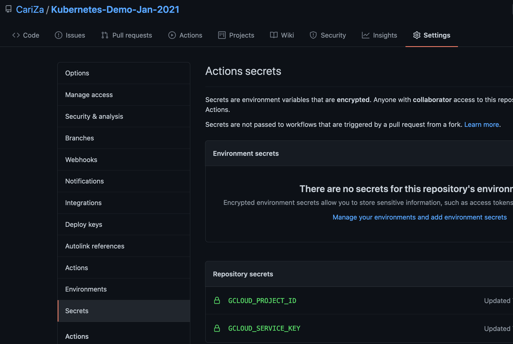

# Kubernetes-Demo-Jan-2021

Hi! Welcome! 

This is a repo I put together for a demo.

## What does this do?

A Kubernetes cluster is spun up to use as part of a demo.

## How?

A Kubernetes cluster is spun up using [GCP](https://console.cloud.google.com/)'s gcloud cli, take a look at this file in this repo:

    .github/workflows/gitops.yml

That's using github actions to run the gcloud cli commands.

You'll see some if's:

    if: startsWith(github.ref, 'refs/tags/release-')

## Release tags with github actions

I'm leveraging github's tagging functionality to trigger the creation and deletion of the cluster.

Take a look here for the tags I've been creating:

https://github.com/CariZa/Kubernetes-Demo-Jan-2021/releases

The way I've used it is more just for demo purposes, you can leverage git in many ways - eg on commits or on branches.

Read the github actions documentation here:

https://docs.github.com/en/actions/reference/context-and-expression-syntax-for-github-actions#example-expression-in-an-if-conditional

## Service Accounts with [GCP](https://console.cloud.google.com/)

How about the [GCP](https://console.cloud.google.com/) side, how am I connecting from github actions to [GCP](https://console.cloud.google.com/)? 

Well I created a [service account](https://cloud.google.com/iam/docs/creating-managing-service-accounts), and gave the service account permissions to create clusters. Then I stored the credentials json I downloaded when I created the service account as a base64 encoded secret on github.

Read more on creating service accounts with [GCP](https://console.cloud.google.com/):

https://cloud.google.com/iam/docs/creating-managing-service-accounts

Take a look again in this file ".github/workflows/gitops.yml":

    - name: Set up Cloud SDK
      uses: google-github-actions/setup-gcloud@master
      with:
        project_id: ${{ secrets.GCLOUD_PROJECT_ID }}
        service_account_key: ${{ secrets.GCLOUD_SERVICE_KEY }}
        export_default_credentials: true

Here's a screenshot for you of where you can add secrets on github:

# Adding application to kubernetes

I've created these folders:

    ./kubernetes
        ./general

I'm adding in some general yaml files:

## Namespace

I'd like to create a namespace for prometheus called "monitoring":

    kubectl create namespace monitoring --dry-run=client -o yaml > kubernetes/general/monitoring-namespace.yml

## Helm templates

Helm templates are a great way to pull down yaml files to apply to your kubernetes cluster.

https://helm.sh/docs/helm/helm_template/

I'm using the prometheus templates, here are the steps I took to get the templates I'm using:

    $ helm repo add prometheus-community https://prometheus-community.github.io/helm-charts

    $ helm repo update

You can list helm repos:

    $ helm repo list

Retrieve prometheus yaml files:

    $ helm template monitoring --output-dir kubernetes/helm -n monitoring prometheus-community/kube-prometheus-stack \
    --set kubelet.serviceMonitor.https=true \
    --set prometheus.prometheusSpec.serviceMonitorSelectorNilUsesHelmValues=false

Notice the "-n monitoring"? That's going to use the namespace we want to setup.

There is now these folders:

    ./kubernetes
        ./helm
            ./kube-prometheus-stack
                ./charts
                    ...
                ./templates
                    ...

